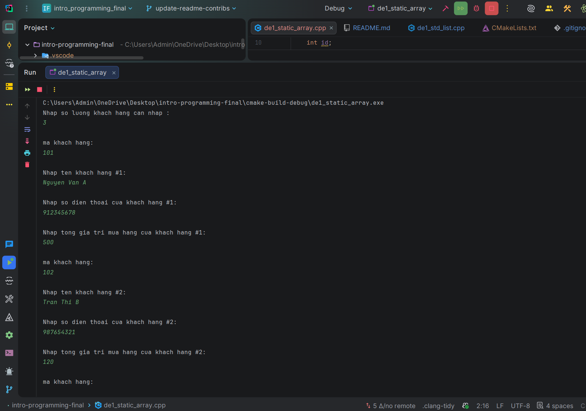
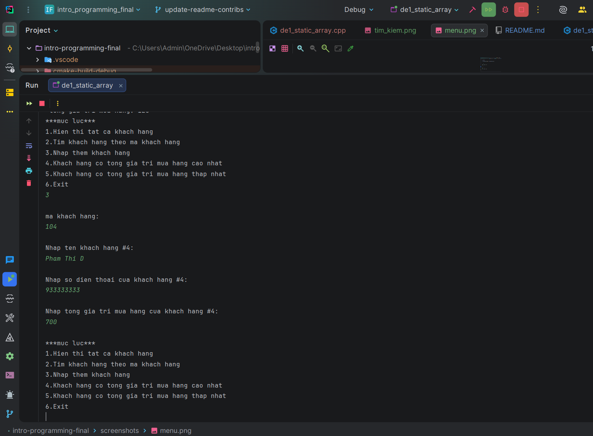
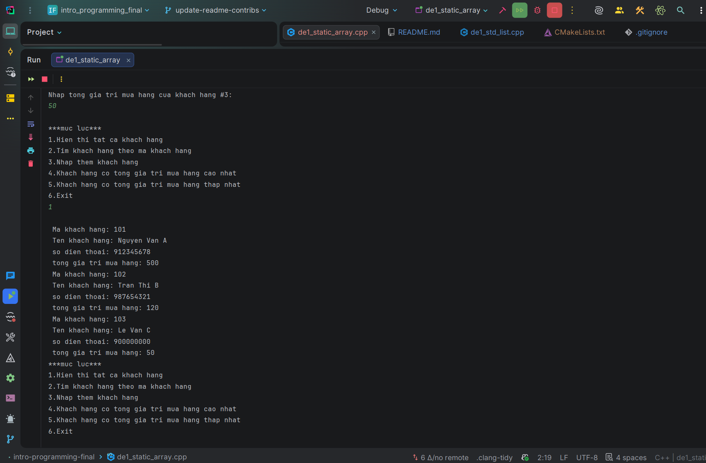
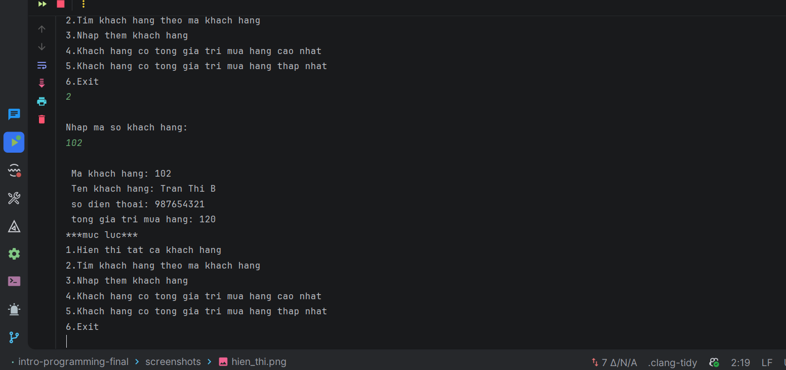
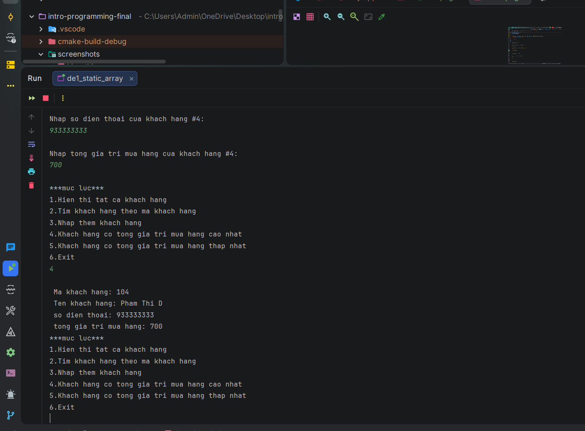
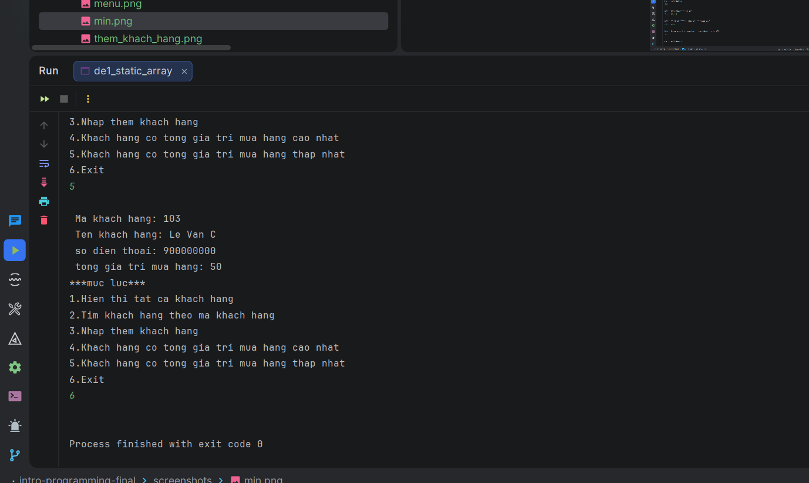

# Nhập môn lập trình — Đề 1: Quản lý thông tin khách hàng

> Bài tập dự án học phần AET2014 (HP3)

## Mục lục
- [Thông tin học phần](#thông-tin-học-phần)
- [Nhóm thực hiện](#nhóm-thực-hiện)
- [Yêu cầu đề tài](#yêu-cầu-đề-tài)
- [Chức năng đã triển khai](#chức-năng-đã-triển-khai)
- [Kiểm tra dữ liệu](#kiểm-tra-dữ-liệu)
- [Thiết kế & cấu trúc dữ liệu](#thiết-kế--cấu-trúc-dữ-liệu)
- [Cấu trúc repo](#cấu-trúc-repo)
- [Đánh giá code](#đánh-giá-code)
- [Bảng đóng góp](#bảng-đóng-góp)
- [Ảnh chụp màn hình](#ảnh-chụp-màn-hình)

## Thông tin học phần
| Mục | Nội dung |
| --- | --- |
| Học phần | AET2014 — Nhập môn lập trình |
| Lớp HP | HP3 |
| Đề tài | Viết chương trình quản lý thông tin khách hàng bằng C++ |

## Nhóm thực hiện
| STT | Mã số SV | Họ và tên | Ngày sinh | Ghi chú |
| --- | --- | --- | --- | --- |
| 1 (Nhóm trưởng) | 25112107 | Nguyễn Tuấn Thành | 17/11/2007 | |
| 2 | 25112091 | Trần Hà Nguyên | 04/09/2007 | |
| 3 | 25112093 | Nguyễn Ngọc Khôi Nguyên | 01/11/2007 | |

## Yêu cầu đề tài
Thông tin mỗi khách hàng:
- Mã khách hàng
- Họ tên khách hàng
- Số điện thoại
- Tổng giá trị mua hàng

Chức năng bắt buộc:
- Nhập liệu (thêm khách hàng mới vào danh sách).
- Hiển thị tất cả danh sách khách hàng.
- Tìm kiếm theo mã khách hàng.
- Hiển thị khách hàng có tổng giá trị mua hàng cao nhất.
- Hiển thị khách hàng có tổng giá trị mua hàng thấp nhất.
- Sử dụng danh sách liên kết đôi; class, object (tùy chọn cách).
- Code lại chương trình bằng cách khác (mảng/list).
- Có phần đánh giá code + ảnh chụp màn hình + bảng % đóng góp.

## Chức năng đã triển khai
- [x] Menu text, có tùy chọn thoát.
- [x] Thêm khách hàng mới.
- [x] Hiển thị toàn bộ danh sách.
- [x] Tìm kiếm theo mã.
- [x] Hiển thị khách hàng có tổng mua cao nhất.
- [x] Hiển thị khách hàng có tổng mua thấp nhất.
- [x] Bản std::list (`de1_std_list.cpp`).
- [x] Bản mảng tĩnh (`de1_static_array.cpp`).

## Kiểm tra dữ liệu
- Hiện chưa có kiểm tra trùng mã, số điện thoại, hoặc tổng giá trị mua hàng.
- (Bản mảng tĩnh) Giới hạn số lượng khách hàng tối đa 1000.

## Thiết kế & cấu trúc dữ liệu
- `individual`: lưu mã, tên, số điện thoại, tổng mua.
- `std::list<individual>`: danh sách liên kết đôi (bản `de1_std_list.cpp`).
- `individual[]` + `n`: danh sách mảng tĩnh (bản `de1_static_array.cpp`).

## Cấu trúc repo
| Tệp | Mô tả |
| --- | --- |
| `de1_std_list.cpp` | Mã nguồn chương trình (std::list - danh sách liên kết đôi). |
| `de1_static_array.cpp` | Mã nguồn chương trình (mảng tĩnh). |
| `README.md` | Báo cáo/đánh giá dự án. |
| `De thi vs tieu chi cham-Nhap mon lap trinh 2025 - 712026-2.pdf` | Đề thi và tiêu chí chấm. |
| `Nhapmonlaptrinh.docx` | Thông tin lớp và danh sách thành viên. |

## Đánh giá code
**Ưu điểm**
- Có đủ 2 phiên bản: std::list (linked list) và mảng tĩnh.
- Dữ liệu rõ ràng, thao tác danh sách đơn giản, dễ theo dõi.

**Hạn chế**
- Cả hai bản chưa có validation trùng mã/SDT/tổng mua.
- Chưa có chức năng sửa/xóa hoặc lưu/đọc file.

**Test case gợi ý**
Áp dụng khi bổ sung validation.

| Trường hợp | Dữ liệu vào | Kỳ vọng |
| --- | --- | --- |
| Trùng mã | Nhập mã đã tồn tại | Báo trùng và yêu cầu nhập lại |
| SDT sai | Chứa ký tự chữ hoặc độ dài < 9 | Báo sai và yêu cầu nhập lại |
| Tổng âm | `-1` | Báo sai và yêu cầu nhập lại |
| Danh sách rỗng | Chọn tìm kiếm/hiển thị | Thông báo danh sách rỗng |

**Cải tiến đề xuất**
- Bổ sung validation cho cả hai bản (trùng mã, SDT, tổng mua).
- Thêm sửa/xóa khách hàng, sắp xếp theo tổng mua.
- Lưu dữ liệu ra file và đọc lại khi chạy.

## Bảng đóng góp
| Thành viên | % đóng góp | Vai trò/ghi chú |
| --- | --- | --- |
| Nguyễn Tuấn Thành | TBD | Static array (`de1_static_array.cpp`) |
| Trần Hà Nguyên | TBD | std::list (`de1_std_list.cpp`) |
| Nguyễn Ngọc Khôi Nguyên | TBD | |

## Ảnh chụp màn hình

### Menu

### Thêm khách hàng

### Hiển thị

### Tìm kiếm

### Max

### Min

### Exit

